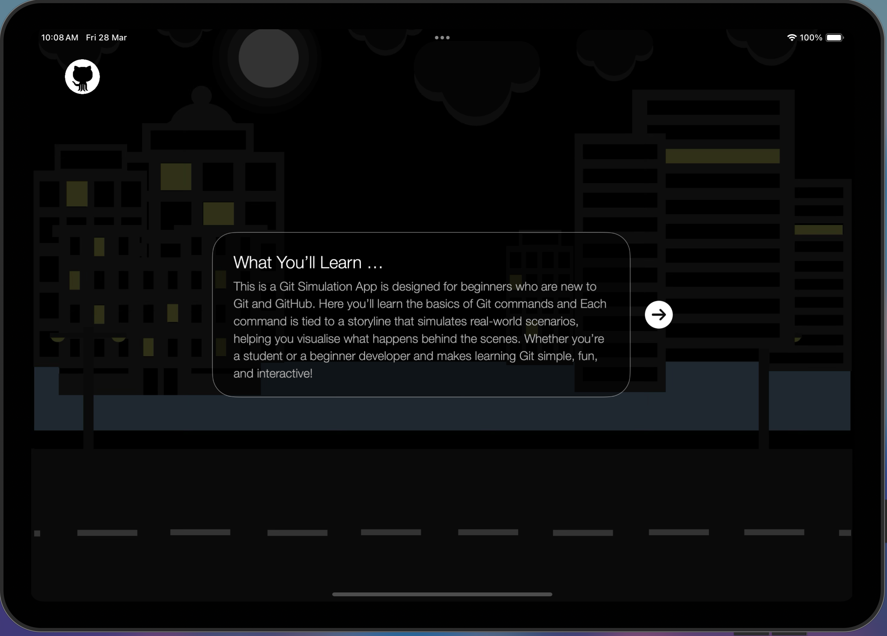
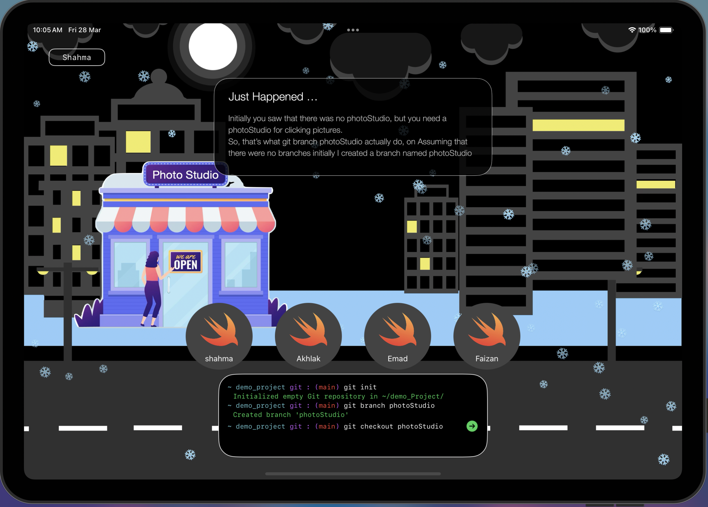
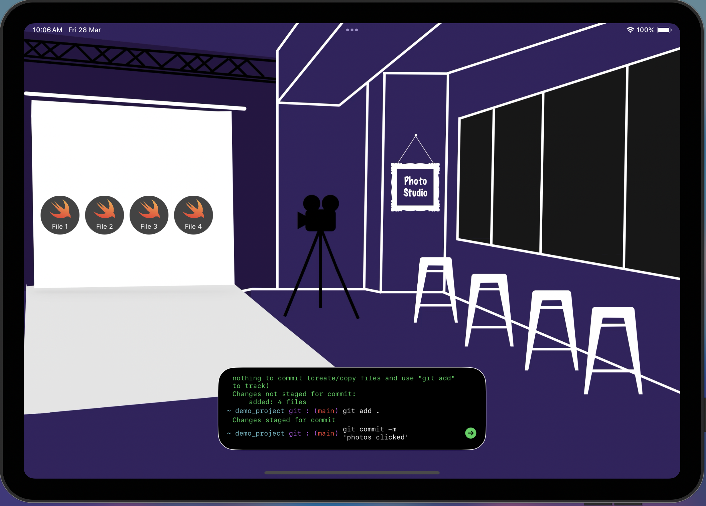

# GitTales

A storytelling approach to learning Git commands through interactive simulations on iPad. Winner of **WWDC 2025 Swift Student Challenge**.

gitTales transforms complex Git concepts into engaging stories, making version control accessible for beginners through visual storytelling and hands-on practice.

## Features

- Interactive Git command simulations
- Story-driven learning approach  
- Visual representations of Git workflows
- Beginner-friendly explanations
- Native iPad experience

## Screenshots

  

## Demo Video

*See how Git concepts come to life through storytelling*

---

**Built with Swift and SwiftUI for iPadOS**
